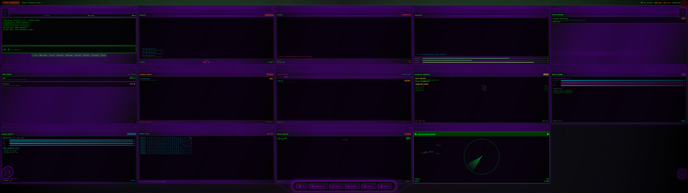

# 🚀 HackerSpace: The Ultimate Developer's Playground

<div align="center">


*A gift for developers everywhere - Happy Developer's Day! 🎉*

**Experience the thrill of being in a Hollywood hacker movie, right from your desktop!**

</div>

## 🎬 What is HackerSpace?

HackerSpace is a stunning Flutter desktop application that transforms your screen into an authentic-looking hacker's workstation. Complete with animated terminals, data streams, system monitors, and all the cyberpunk aesthetics you've ever dreamed of - it's like stepping into *The Matrix* or *Mr. Robot*!

Perfect for:
- 🎭 Impressing friends and colleagues
- 🎬 Creating awesome screenshots and demos
- 🎮 Having fun while learning Flutter
- 🔥 Adding some cyberpunk flair to your workspace
- 🎁 Celebrating the art of development

## 📸 Screenshot

<div align="center">



*Experience the authentic hacker workstation interface*

</div>

## ✨ Features That'll Blow Your Mind

### 🖥️ **Immersive Hacker Interface**
- **Full-screen terminal experience** with hidden window controls
- **Real-time animated text streams** that look like actual hacking
- **Multiple specialized panels** including:
  - 🛡️ Vulnerability Scanner
  - 🔐 Cryptography Tools
  - 🌐 Network Monitor
  - 📊 System Performance
  - 🧠 Neural Network Visualizer
  - ⚛️ Quantum Computing Panel
  - 💎 Blockchain Explorer
  - 🌍 Geolocation Tracker
  - 📡 Data Stream Monitor

### 🎨 **Cinematic Effects**
- **Matrix-style falling code** animation
- **Glitch effects** for that authentic cyberpunk feel
- **Scanline animations** like old-school CRT monitors
- **Pulsing indicators** and status lights
- **Dark web onion routing** simulations
- **Realistic terminal typing** effects

### 🏗️ **Professional Architecture**
- Built with **Flutter BLoC** for clean state management
- **Responsive design** that adapts to different screen sizes
- **Modular widget architecture** for easy customization
- **Cross-platform desktop support** (Windows, macOS, Linux)

## 🚀 Quick Start

### Prerequisites
- Flutter SDK 3.8.1 or higher
- Desktop development enabled for Flutter

### Installation

1. **Clone this awesome project:**
   ```bash
   git clone https://github.com/yourusername/hackerspace.git
   cd hackerspace
   ```

2. **Install dependencies:**
   ```bash
   flutter pub get
   ```

3. **Run and watch the magic happen:**
   ```bash
   flutter run -d windows  # or -d macos, -d linux
   ```

That's it! Your screen will transform into a hacker's paradise! 🎉

## 🎯 Usage Tips

- **Full-screen mode:** The app automatically launches in full-screen for maximum immersion
- **Exit gracefully:** Use `Alt+F4` (Windows) or `Cmd+Q` (macOS) to close
- **Screenshots:** Perfect for creating awesome developer portfolio images
- **Presentations:** Great for tech talks and cybersecurity presentations

## 🛠️ Tech Stack

This project showcases some amazing Flutter packages:

- **🎨 UI & Animations:**
  - `animated_text_kit` - For those smooth typing effects
  - `google_fonts` - Beautiful monospace fonts
  
- **🖥️ Desktop Integration:**
  - `window_manager` - Full-screen and window control magic
  
- **🏗️ Architecture:**
  - `flutter_bloc` - Clean state management
  - `equatable` - Value equality made easy
  
- **💾 Data & Storage:**
  - `dio` - HTTP client for network simulations
  - `shared_preferences` - Local data persistence
  - `uuid` - Unique identifier generation

## 🎨 Customization

Want to make it your own? Here are some fun ideas:

1. **Add your own hacking scenarios** in `lib/models/hacker_models.dart`
2. **Create new animated panels** in `lib/widgets/`
3. **Modify the color schemes** to match your favorite cyberpunk aesthetic
4. **Add sound effects** for even more immersion
5. **Create themes** for different hacker movie styles

## 🧪 Testing

Run the comprehensive test suite:

```bash
flutter test
```

We've included tests for:
- Widget rendering
- BLoC state management
- Performance benchmarks
- Animation controllers

## 🤝 Contributing

Found a bug? Have a cool feature idea? Contributions are welcome! 

1. Fork the repo
2. Create your feature branch (`git checkout -b feature/AmazingFeature`)
3. Commit your changes (`git commit -m 'Add some AmazingFeature'`)
4. Push to the branch (`git push origin feature/AmazingFeature`)
5. Open a Pull Request

## 📝 License

This project is licensed under the MIT License - see the [LICENSE.md](LICENSE.md) file for details.

## 🎉 Special Thanks

This project was created as a celebration of Developer's Day! A huge shoutout to:

- 👨‍💻 **All developers** who make the digital world possible
- 🎬 **Cyberpunk movies** for the endless inspiration
- 💙 **Flutter team** for creating such an amazing framework
- 🌟 **Open source community** for all the incredible packages

## 🚨 Disclaimer

This is a simulation for educational and entertainment purposes only. No actual hacking is performed, and no systems are compromised. Please use responsibly and respect others' digital privacy and security.

---

<div align="center">

**Made with ❤️ and lots of ☕ for Developer's Day**

*"In a world of code, be the one who makes it beautiful."*

🌟 **Star this repo if it made you smile!** 🌟

</div>
